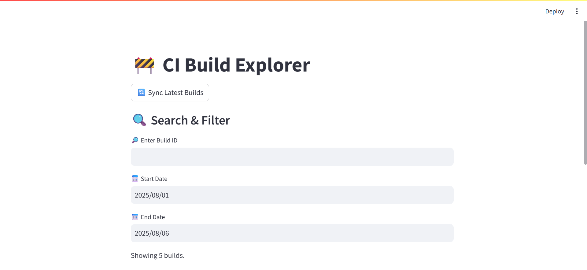
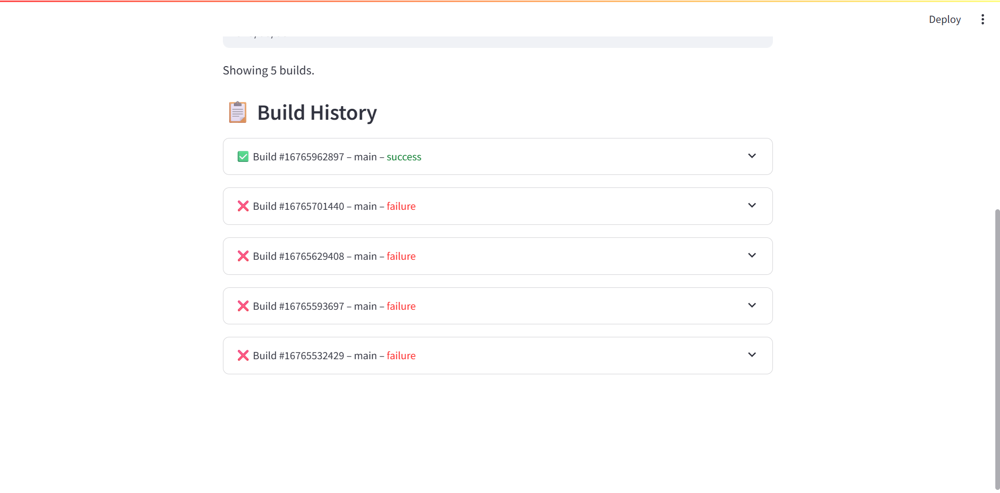
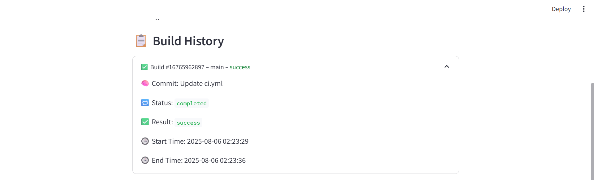
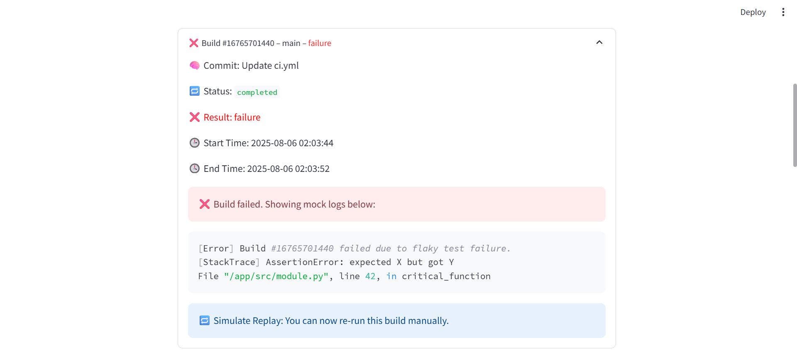

# CI Build Explorer

A lightweight Streamlit dashboard for visualizing GitHub Actions CI build history, filtering results, and replaying failed builds with mock logs.

### 🏁 Dashboard Overview


### 🔍 Build Filtering by ID & Date


### ✅ Successful Build Details


### ❌ Error Trace for Failed Builds


## Features

- 🔄 Sync latest builds from GitHub Actions
- 📅 Filter builds by date and ID
- ✅ View status, logs, and result of each build
- 🧪 Display mock failure logs for failed builds
- 🐛 Simulate “replay” of failed builds

## Tech Stack

- Python, Streamlit
- GitHub Actions API
- SQLite for local storage
- GitHub Web Deployment

## Local Setup

```bash
git clone https://github.com/luoboluoboHu61/ci-build-explorer.git
cd ci-build-explorer
pip install -r requirements.txt
streamlit run app.py
👉 Click here to try it online

📁 Directory Structure
├── app.py               # Main Streamlit app
├── github_api.py        # GitHub Actions API fetch logic
├── db.py                # SQLite database operations
├── data/
│   └── builds.db        # Local DB file
│   └── sample_builds.json
├── requirements.txt     # Python dependencies
├── .gitignore
└── README.md
```
### 🏁 About me
Built by Astra Zheng
Contact: mengyuzheng.zmy@gmail.com
LinkedIn：https://www.linkedin.com/in/astrazheng
